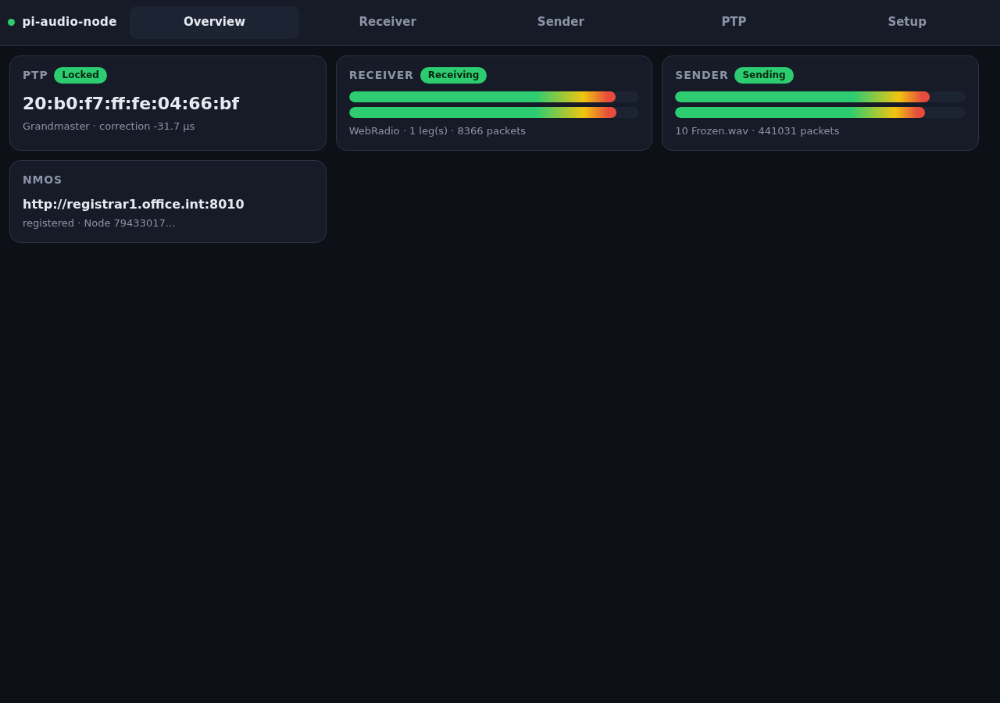
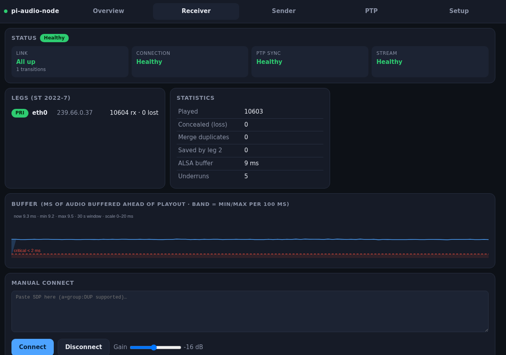
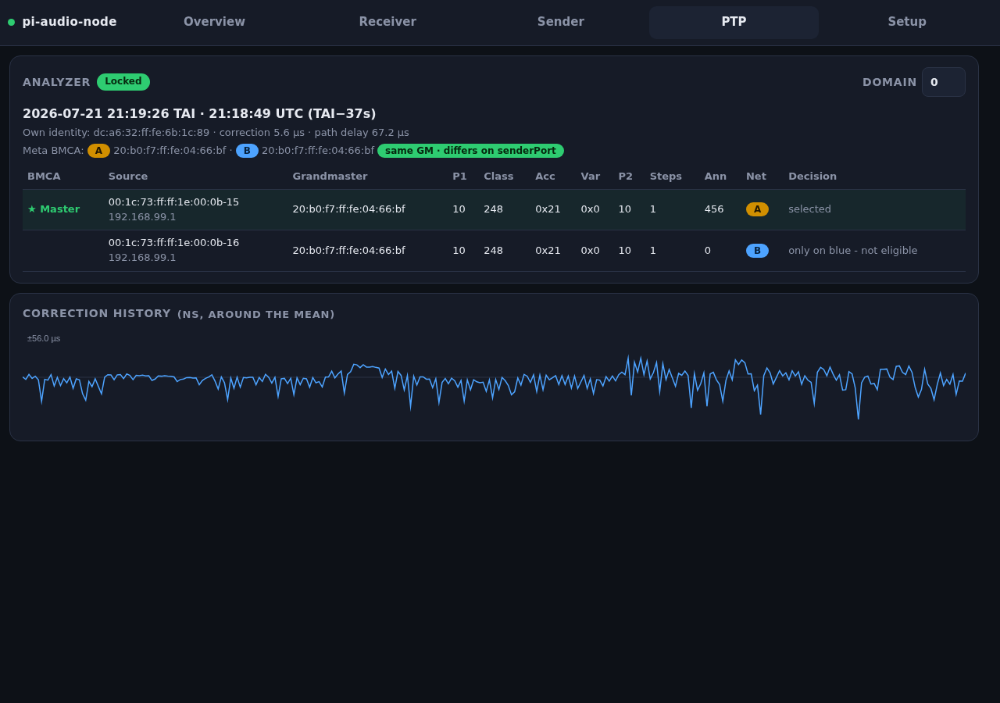
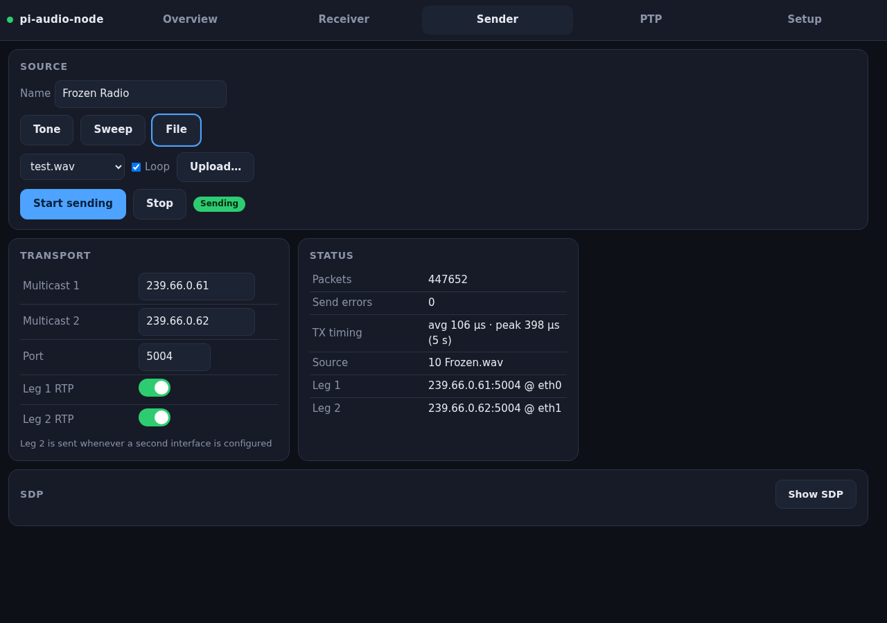
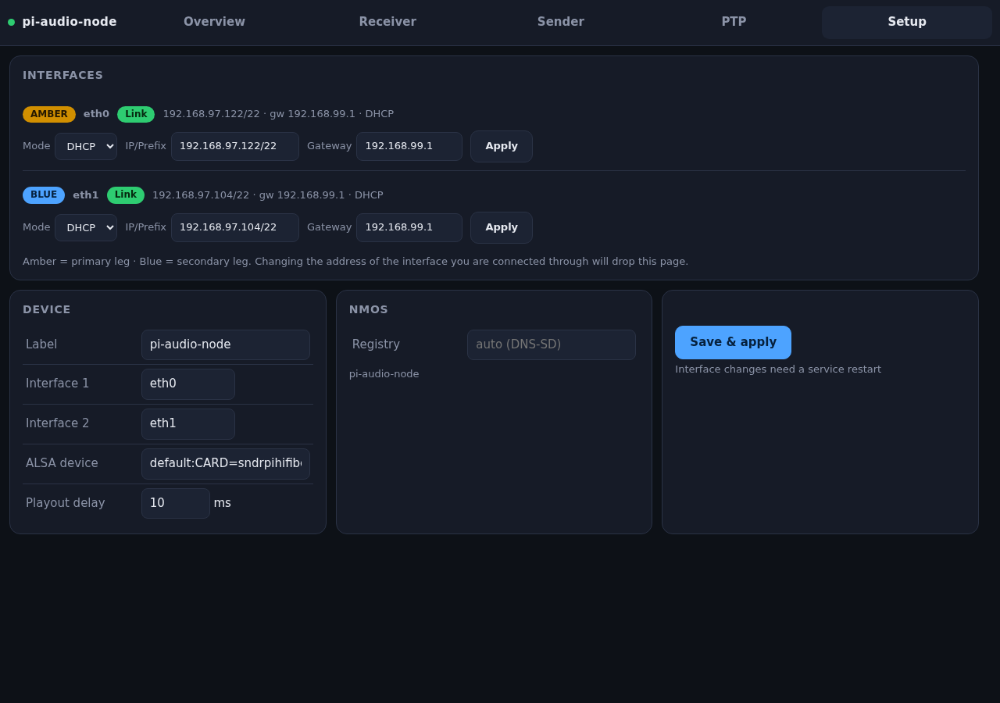

# pi-audio-node

Turns a Raspberry Pi (+ audio HAT) into a modern AES67 audio device:



* **Receiver** — AES67 L24/L16, mono to multichannel, **ST 2022-7 seamless
  protection** over two network interfaces (sequence-merged jitter buffer),
  PTP-anchored playout to ALSA with 5-10 ms delays, buffer/jitter chart,
  **monitor matrix** (pick which source channel plays on each ear)
* **Sender** — test tone / sweep / WAV / MP3, paced by the **PTP media clock**
  (realtime thread, absolute deadline scheduling, avg send jitter well under
  0.1 ms), identical-packet 2022-7 duplication, SDP with `a=group:DUP`,
  per-leg live RTP enable
* **PTP analyzer** — own IEEE 1588-2008 slave with **full BMCA** (every announce
  source with its complete dataset and the field the decision fell on),
  **meta BMCA across both networks** (amber/blue grandmaster comparison),
  live TAI/UTC clock, servo correction history, path delay (E2E)
* **NMOS** — IS-04 registration (unicast DNS-SD via plain `res_query` +
  override) with immediate resource updates, IS-05 with two transport-param
  legs, **IS-12 control protocol** with **BCP-008-01/-02** receiver/sender
  status monitors (3 s status reporting delay), **registry sender browser**:
  list every audio sender in the registry, patch one onto the receiver with
  a tap
* **Web UI** — touch-friendly dark SPA (dashboard, receiver, sender, PTP
  analyzer, settings incl. amber/blue interface + IP setup), 20 Hz level
  meters, served by the built-in web server, shown fullscreen on the Pi's
  touchscreen via Chromium kiosk; the page reloads itself when a new build
  or UI version is deployed

Single C++20 daemon, no heavyweight frameworks: civetweb, nlohmann-json,
minimp3, dr_wav (vendored) + ALSA and libsamplerate from apt.

## Screenshots

| Receiver | PTP analyzer |
|---|---|
|  |  |

| Sender | Setup |
|---|---|
|  |  |

## Install (Raspberry Pi OS, labwc desktop)

```
git clone https://github.com/Gemini2350/pi-audio-node.git
cd pi-audio-node && ./install.sh
```

That installs dependencies, builds, sets up the `pi-audio-node` systemd service
and the fullscreen kiosk UI, both starting at boot. Config lives in
`~/pi-audio-node.json`, audio files in `~/audio-files`.
`./install.sh --build` rebuilds and installs without touching the service or
kiosk setup.

## Notes

* PTP uses software timestamps (Pi 4 has no NIC timestamping): offset jitter is
  tens of microseconds - fine for AES67 media clocking, not a boundary clock.
  The clock syncs on the primary (amber) interface; the secondary (blue) is
  monitored for announces so both networks can be compared.
* RTP timestamps are the real PTP media clock (`a=mediaclk:direct=0`), so
  strict receivers validate them against their own PTP time.
* The IS-12 endpoint is `ws://<pi>:8080/x-nmos/ncp/v1.0`, advertised as a device
  control. Registration expects a registry announced via unicast DNS-SD
  (`_nmos-register._tcp` in the DNS search domain) or set `nmos.registry_override`.
* Ports 80/319/320 are bound via `cap_net_bind_service`, the realtime pacing
  threads via `cap_sys_nice` (both set by the installer).
* The installer sets `arp_ignore=1` / `arp_announce=2`: with both legs attached
  to one subnet the kernel would otherwise answer ARP for either address on
  either NIC, which trips NetworkManager's address-conflict detection.
  Separate subnets/VLANs per leg remain the recommended setup.
